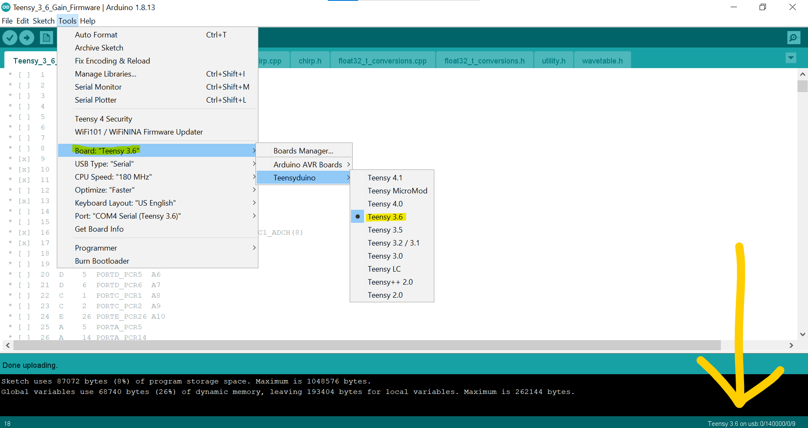
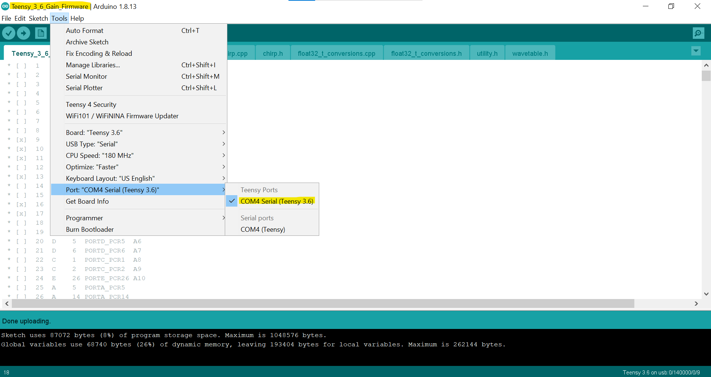

`⚠️ Windows computers only`
# CTS Documention

An overview of the process for setting up CTS controllers to connect and output data onto a computer. </br>
- For a brief overview of the project itself, visit this [demo.](https://tpcav.github.io/CTS/)

## Table of Contents
1. Packages & Installations
2. Visual Studio .NET Visualizer
3. Connection to Socket
4. Pygame Demos
5. Pynput Keyboard Control

---

### 1. Packages & Installations
- [Visual Studio](https://visualstudio.microsoft.com/downloads/) (2019 or 2022)
- [Arduino](https://www.arduino.cc/en/software)
- [Teensyduino](https://www.pjrc.com/teensy/td_download.html)
- [Python](https://www.python.org/downloads/)
- [Pygame](https://www.pygame.org/download.shtml)
or run: `python3 -m pip install -U pygame --user`</br>
- [Pynput](https://pypi.org/project/pynput/#files)

---

### 2. Visual Studio .NET Visualizer

Steps:
  1. Make sure Teensyduino is installed and connected to Arduino application, see photos below:
  
  <p align="center">
  
  </p>
  <p align="center">
  
  </p>
  
  2. Plug CTS controller into computer.
  3. Open Arduino file called ``Teensy_3_6_Gain_Fireware``.
  4.  Make sure the port number is correctly assigned:
```
This is going to be some example code
```

---

### 3. Connection to Socket

Steps:
  1. Open Visual Studio BLANK project folder.
  2. Run BLANK file.
  3. Open `socket.py` file which uses the following to make a connection & recive data:
  ```
import socket

s = socket.socket(socket.AF_INET, socket.SOCK_STREAM)
remote_ip = socket.gethostname()
s.connect((remote_ip, 8888))

while True:
    data = s.recv(1024)
    sf = str(data).split(',')[0]

    # Filter out digits from string data
    only_digits = "".join([c for c in sf if c.isdigit()]) 

    # Convert string data to float
    f = int(only_digits)

    print(f)
  ```
  5. No data on first try, run all programs again in same order.
  6. If input data is skewed, reflash the device by uploading the Arduino sketch again.
---

### 4. Pygame Demos

Steps:
1. With pygame created, implement `socket.py` into pygame file.
2. Do this first (insert screenshot).
3. Then put this here (insert screenshot).
4. Set threshold depending on data values.
5. Set controls using if statement threshold.
6. Open Visual Studio BLANK project folder.
7. Run BLANK file.
8. Then, run pygame file.
9. Connection should now be successful.
---

### 5. Pynput Keyboard Control

Steps:
1. Create a new python file.
2. Now put the following at the top:
```
import socket
from pynput.mouse import Button, Controller
```
3. Implement `socket.py` into pynput file, for example:
```
import socket
from pynput.mouse import Button, Controller

# Mouse Stuff
mouse = Controller()

# Socket Stuff
s = socket.socket(socket.AF_INET, socket.SOCK_STREAM)
remote_ip = socket.gethostname()
s.connect((remote_ip, 8888))

while True:
    # Recieve data
    data = s.recv(1024)
    sf = str(data).split(',')[0]

    # Filter out digits from string data
    only_digits = "".join([c for c in sf if c.isdigit()])

    # Convert string data to float
    f = int(only_digits)

   # Threshold range for CTS actions
    if f < 430000:
        mouse.scroll(0, -0.20)
        # mouse.click(Button.left, 1)
    if f > 590000:
        mouse.scroll(0, 0.20)
```

5. Specify threshold for controller data.
6. Set controls using if statement threshold.
7. Control scroll with the code below:
```
# Scroll down
mouse.scroll(0, -0.20)
# Scroll up
mouse.scroll(0, 0.20)
```
8. Control mouse click with the code below:
```
# Single left click (2 for double click)
mouse.click(Button.left, 1)
# Single right click
mouse.click(Button.right, 1)
```
---
